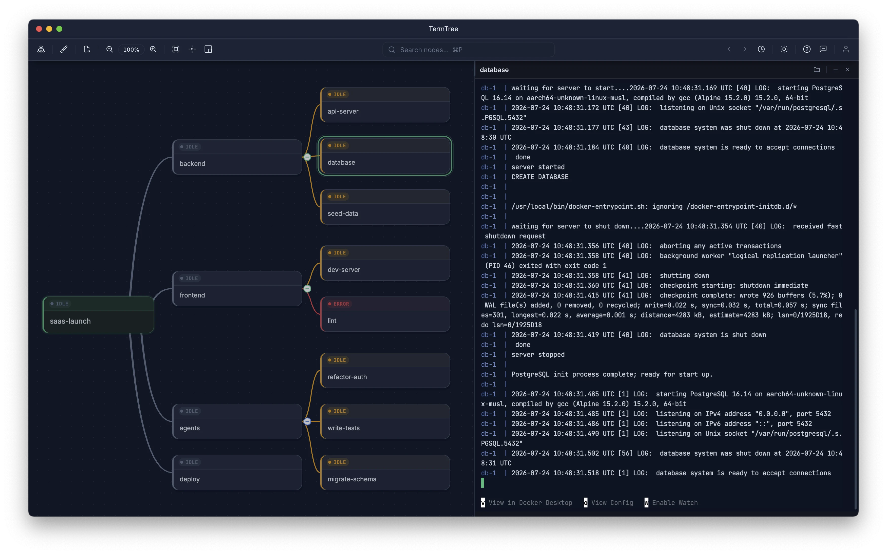

# TermTree

Organize terminals and AI agents as a live mind map. Run work in parallel, spot waiting or failed tasks instantly, and stay in control.



## What it is

One terminal is simple. Ten parallel tasks are not. Tabs hide how tasks relate, background agents wait or fail without being noticed, and every context switch asks you to remember what each shell was doing.

TermTree is a desktop app that gives each task a place, each place a real terminal, and each terminal a live signal you can understand at a glance. Arrange tasks by project, service, feature, or goal so their relationships stay visible. Launch shells, servers, tests, scripts, Claude Code, Codex, or any other CLI in the nodes. See what is active, quiet, waiting, or failed, and jump straight to the task that matters.

Free for personal use. macOS, Windows, and Linux.

## Install

Download from **[termtree.com/download](https://termtree.com/download)** — macOS (universal), Windows (x64), Linux (amd64).

Or on macOS and Linux:

```sh
curl -fsSL https://termtree.com/install.sh | sh
```

Piping a script into a shell deserves a look first — read exactly what will run at
[termtree.com/install.sh](https://termtree.com/install.sh).

| Platform | Requirement | Formats |
|---|---|---|
| macOS | macOS 12+, Intel & Apple Silicon | DMG, tar.gz |
| Windows | Windows 10+, 64-bit (x64) | MSI, NSIS |
| Linux | Ubuntu 22.04+ / Debian 12, x86_64 | AppImage, DEB, RPM |

## Quickstart

1. **Install and launch.** You'll see a mind map canvas with a single root node.
2. **Build the plan.** With the root node selected, press <kbd>Tab</kbd> to add a child. It opens for renaming straight away, so type a name and press <kbd>Enter</kbd> to confirm. From any selected node, <kbd>Tab</kbd> adds a child beneath it and <kbd>Enter</kbd> adds a sibling beside it. Lay out the work before you start any of it.
3. **Launch a terminal into a node.** Select it and press <kbd>Cmd+Shift+Enter</kbd> (<kbd>Ctrl+Shift+Enter</kbd> on Windows and Linux). A real PTY-backed terminal opens in that node's project directory.
4. **Start an agent.** Run `claude`, `codex`, a dev server, or a test suite in that terminal, exactly as you would in your own shell. Repeat across nodes to run work in parallel.
5. **Watch the map, not the tabs.** Each node's status dot turns blue while output is flowing, amber when it goes quiet, orange when a process is blocked waiting on you, and red when a command exits non-zero. Jump to whatever needs a decision.

Full walkthrough: **[Getting Started](https://termtree.com/guide/getting-started)**.

## Features

- **A map, not a tab bar.** Plan work as a tree of task nodes, then launch a terminal into a node when you're ready. Pan, zoom, drag to reorganize, collapse a finished branch, and choose from eight tree layouts.
- **Live status on every node.** Running, idle, waiting for input, or failed — so nothing quietly gets stuck in the background. A chime and waiting-first cycling take you straight to whatever is blocked on you.
- **Real terminals.** Every node opens a PTY-backed terminal in its own project directory. Search within a terminal, keep related shells side by side or stacked, and pick up your shell history as usual.
- **Agent awareness.** TermTree recognizes Claude Code and Codex sessions, marks the git worktree each one is working in, and offers to resume a session where you left off.
- **The terminal is your file explorer.** Click any file path your tools print — even one wrapped across lines — to open it beside the session that produced it. Edit it, review its changes against Git, then save.
- **Preview and export.** Markdown as formatted prose with rendered Mermaid diagrams, HTML files as live pages, PDFs and images, and export to DOCX.
- **Session restoration.** Return to the same tree, layout, terminals, scrollback, and recent files after restarting.
- **Themes and languages.** Nine themes covering the map, terminal, and editor together, adjustable map styling, and 11 UI languages that switch live.

### What it is not

- **Not an Electron app.** TermTree is built on Tauri, with a Rust core and the operating system's own webview rather than a bundled copy of Chromium.
- **Not tied to one agent.** Claude Code, Codex, and any other CLI run in ordinary terminals using their own accounts and subscriptions. TermTree does not resell, wrap, or meter them.
- **Not a new project format.** Your files stay where they are. No proprietary workspace, no mandatory cloud — sync exists, but it is optional and only runs when you sign in.
- **Not capped.** The full local app is free for personal use, with uncapped nodes and terminal sessions, no feature timer, and no credit card.

## Issues and support

This repository is TermTree's public issue tracker. The application itself is closed source, so there is no code here — but bug reports, feature requests, and questions are all welcome and are read.

- **Found a bug?** [Open a bug report](https://github.com/documentnode/termtree/issues/new?template=bug_report.yml). Include your OS, TermTree version, and steps to reproduce.
- **Want a feature?** [Open a feature request](https://github.com/documentnode/termtree/issues/new?template=feature_request.yml).
- **Have a question?** [Ask here](https://github.com/documentnode/termtree/issues/new?template=question.yml).
- **Security vulnerability?** Do not open an issue — see [SECURITY.md](SECURITY.md).

You can also send feedback from inside the app using the feedback button in the toolbar, which attaches your version and platform automatically. For account, billing, or licence questions, email [support@documentnode.io](mailto:support@documentnode.io).

Response times vary, but every issue gets triaged.

## Links

- [Website](https://termtree.com)
- [Download](https://termtree.com/download)
- [Guide](https://termtree.com/guide/getting-started)
- [Pricing](https://termtree.com/pricing)
- [Changelog](CHANGELOG.md) · [What's new](https://termtree.com/whats-new)
- [Licence terms (EULA)](https://termtree.com/eula) · [Privacy](https://termtree.com/privacy) · [Terms](https://termtree.com/terms)

---

TermTree is a product of Document Node Pty Ltd. See [LICENSE.md](LICENSE.md) for what this repository does and does not cover.
